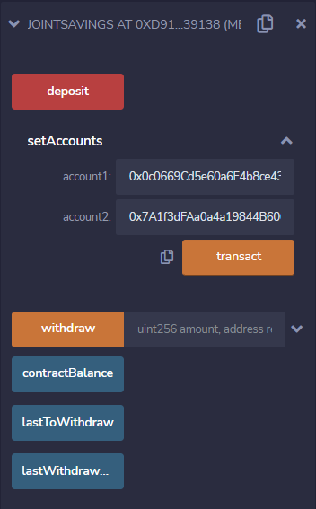
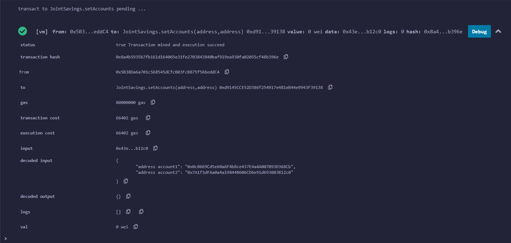
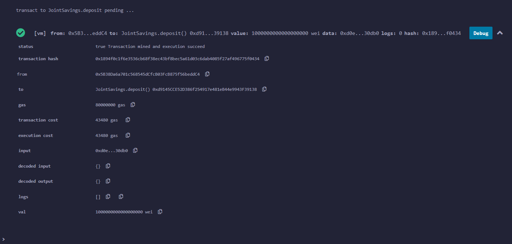
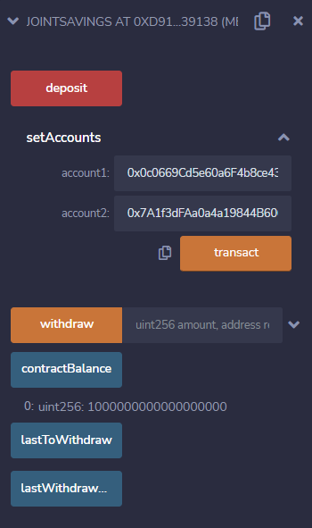
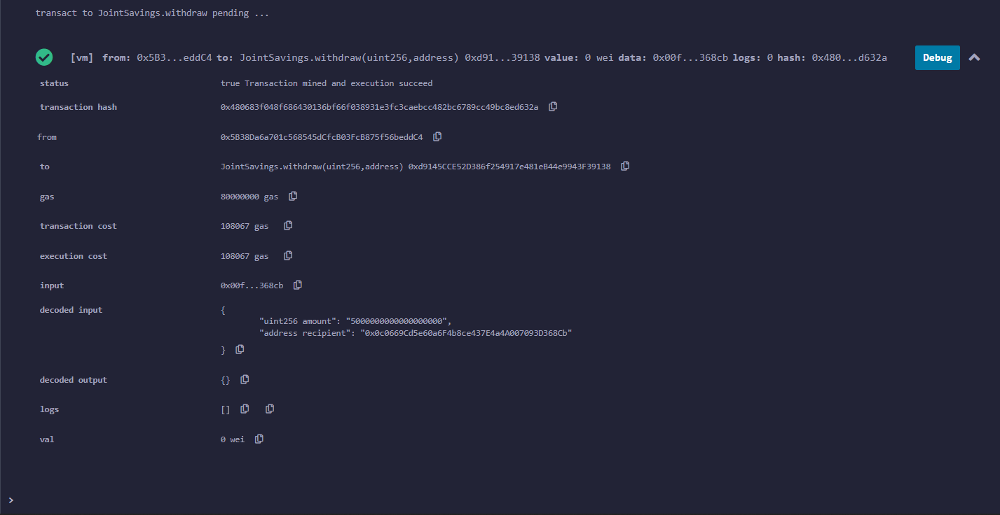
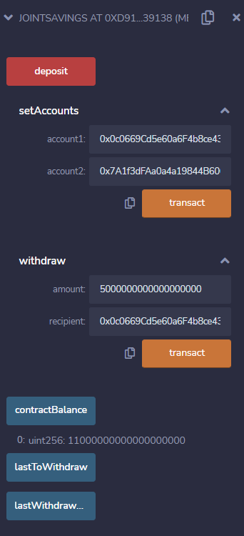
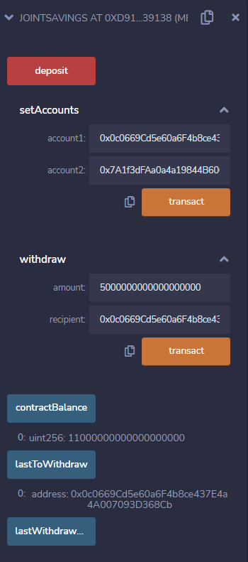
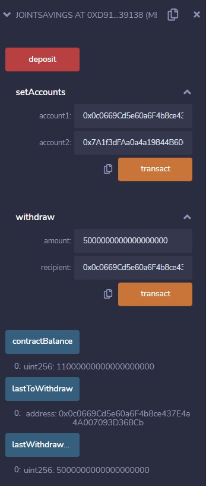

# Joint Savings Account
This Solidity smart contract hosts joint savings accounts using ether management functions in order to provide the features of the accounts. More specifically, it accepts two account addresses that are able to control the joint savings account by depositing or withdrawing funds from the account.

## Technologies
The technology required to use this project is the Remix IDE, which is a local blockchain development environment that provides a JavaScript VM. 

## Examples
Upon deploying the smart contract, the users are presented with three functions: deposit, setAccounts, and withdraw. In addition to the functions, there are three buttons for displaying contract variables: contractBalance, lastToWithdraw, and lastWithdrawalAmount. Following are explanations for how the functions work, and screenshots of examples that were used to test their functionality.

**Set Accounts:**

The "setAccounts" function allows the user to enter two account addresses: "account1" and "account2". Once two valid addresses are entered, and the user clicks the "transact" button, the addresses are set as the only addresses that can withdraw from the joint savings account smart contract. 

The following screenshot shows the details of successfully executing the "setAccounts" function.

**Deposit:**

**Withdraw:**

